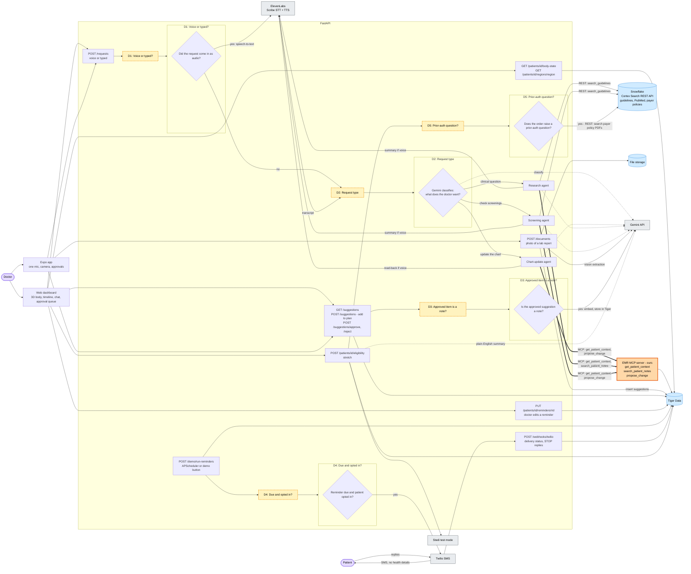

# AI-Powered EMR: Routing Graph (v2)

Hackathon build only: no scaling, caching or queues. Each database is shown as a single node.

Changes from v1 (`system-design-routing.md`):

- **Snowflake is called through its REST API, not MCP.** The Snowflake MCP server is gone. `search_guidelines` is a plain Gemini function tool that sends a Cortex Search REST query with `httpx` and passes only a de-identified clinical description. The eligibility endpoint calls the same REST API.

Changes from draft-1:

- **No Dictate/Ask toggle.** There's one mic, and typed web chat goes to the same place. Every request works like Ask did: Gemini figures out what the doctor wants and routes it. Nothing writes to the chart directly. Chart updates become suggestions the doctor approves.
- **No autonomous AI.** Agents run only when the doctor asks. The nightly reminder-agent job is gone, and an approval no longer triggers the reminder agent on its own. SMS sending is still scheduled because it's plain code, not AI.
- **Patient-data tools are MCP.** Every time an agent reads or proposes something in Tiger, it goes through the EMR MCP server. Those calls are the **thick arrows**.

How to read it:

- **Yellow dashed box**: a decision. It points into the subgraph with the same name.
- **Orange node**: an MCP server. **Thick arrow**: an MCP tool call.
- **Blue cylinder**: a database.
- **Arrow labeled "REST"**: a direct HTTP call to Snowflake, with no MCP in between.

## When MCP is used

| Caller | MCP server | Tools | Reaches |
|---|---|---|---|
| Chart-update agent | EMR MCP (ours) | `get_patient_context`, `propose_change` | Tiger Data |
| Research agent | EMR MCP (ours) | `get_patient_context`, `search_patient_notes` | Tiger Data |
| Screening agent | EMR MCP (ours) | `get_patient_context`, `propose_change` | Tiger Data |

## When Snowflake REST is used

| Caller | How | Searches |
|---|---|---|
| Research agent | `search_guidelines` function tool, Cortex Search REST via `httpx` | USPSTF guidelines, PubMed abstracts |
| Screening agent | `search_guidelines` function tool, Cortex Search REST via `httpx` | USPSTF guidelines |
| Eligibility endpoint (stretch) | Cortex Search REST via `httpx` | Payer policy PDFs |

Snowflake only ever receives de-identified clinical descriptions, never patient records or identifiers.

The plain endpoints never use MCP: body view, photo upload, approvals, reminders, SMS and webhooks call the database or vendor API directly.

`propose_change` can only insert into `ai_suggestions`. The only thing that writes to the chart is `POST /suggestions/approve`, after the doctor clicks it.
